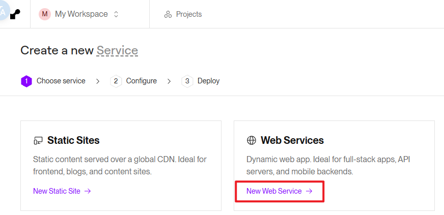
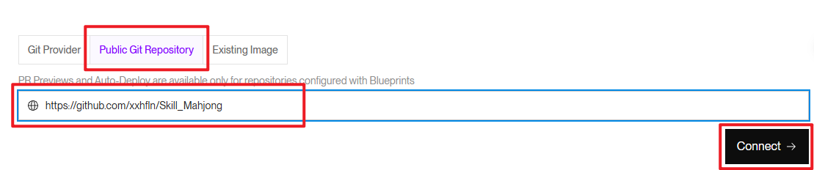

# 部署指南

> 本文档面向想把本项目部署到公网的开发者。项目介绍、玩法规则、本地/局域网玩法见 [README](./README.md)。
> 如果只是朋友线下聚会（同一 Wi-Fi/热点），用 README 第 3 节的局域网玩法即可，**不需要部署**。

---

## 目录

- [第 0 步 · 先在本地跑通](#第-0-步--先在本地跑通2-分钟)
- [路线 A · Render 一键部署（推荐）](#路线-a--render-一键部署推荐免费)
- [路线 B · Docker 部署（任意平台）](#路线-b--docker-部署任意平台)
- [路线 C · Netlify 前端 + Render 后端](#路线-c--netlify-前端--render-后端)
- [路线 D · Cloudflare Tunnel（临时开一局）](#路线-d--cloudflare-tunnel临时开一局)
- [部署后必须知道的 5 件事](#部署后必须知道的-5-件事)
- [排障速查](#排障速查)
- [FAQ](#faq)

---

## 路线 A · Render 一键部署（推荐，免费）

[Render](https://render.com) 的免费层可以跑 Node + WebSocket，注册用 GitHub 账号登录。

仓库里已备好 `render.yaml`（Blueprint 配置），三种方式任选其一。

### 方式 1 · 一键部署按钮（最快）

点这个按钮，授权 GitHub 后按提示确认即可，无需任何配置：

[](https://render.com/deploy?repo=https://github.com/xxhfln/Skill_Mahjong)

大约 1–3 分钟后，你会得到一个形如 `https://skill-mahjong-xxxx.onrender.com` 的网址，直接能玩。

### 方式 2 · Blueprint（自动套好全部配置）

1. 登录 [Render Dashboard](https://dashboard.render.com)
2. 左侧 **Blueprints** → **New Blueprint Instance**
3. 授权并选择本仓库（公开仓库可直接连；私有仓库需安装 Render 的 GitHub App）
4. 确认服务清单 → **Apply**

Render 会读取仓库根目录的 `render.yaml`，自动填好区域、健康检查、Node 版本等所有配置。

### 方式 3 · 手动新建 Web Service（想自己控制每个参数）

1. Dashboard → **New** → **Web Services**

   

2. 选择 **Public Git Repository**，输入仓库地址后点 **Connect**：

   ```
   https://github.com/xxhfln/Skill_Mahjong
   ```

   

3. 按下表填写（**加粗**为必改项，其余默认即可）：

   | 字段 | 填什么 | 说明 |
   | --- | --- | --- |
   | Name | 任意（如 `skill-mahjong`） | 会成为网址的一部分，仅字母/数字/短横线 |
   | **Region** | **Singapore** | 离国内较近；备选 Frankfurt / Oregon |
   | Branch | `main` | 与推送分支一致 |
   | Language | **Node** | Render 自动识别 `package.json` |
   | Build Command | `npm install` | 没有构建步骤 |
   | Start Command | `npm start` | 等价于 `node server/index.js` |
   | Compute | **Free** | 先用免费档验证 |
   
4. 点 **Deploy Web Service**，等日志出现 `Your service is live 🎉`。

### 验证

Render中找到刚部署的项目复制网址到浏览器打开 → 「房间」标签 → 建房，能拿到房间码即成功。

---

## 路线 B · Docker 部署（任意平台）

仓库根目录有现成的 `Dockerfile`，已适配 Render / Fly.io / Railway / Zeabur / 自有服务器。
**什么时候选 Docker**：想锁定运行环境（`node:22-alpine`）、或要在多个平台用同一份配置。

### 在 Render 上用 Docker

把 `render.yaml` 里的 `runtime: node` 改为：

```yaml
services:
  - type: web
    name: skill-mahjong
    runtime: docker
    dockerfilePath: ./Dockerfile
    plan: free
    region: singapore
    branch: main
    healthCheckPath: /health
    envVars:
      - key: PORT
        value: "3000"   # 与 Dockerfile 的 EXPOSE 3000 对齐
```

> 也可以在创建 Web Service 时把 Runtime 手动选成 **Docker**，Dockerfile Path 留默认。
> Render 会克隆仓库 → 构建镜像 → 起容器 → 用 `/health` 做健康检查 → 签发 HTTPS 证书。

### 在其他平台 / 自己的服务器上

```bash
docker build -t skill-mahjong .
docker run -d --name skill-mahjong \
  -p 3000:3000 \
  -e PORT=3000 \
  --restart unless-stopped \
  skill-mahjong
```

浏览器打开 `http://服务器IP:3000` 即可。

---

## 路线 C · Netlify 前端 + Render 后端

页面走 CDN（加载快、不怕后端重启丢页面），后端单独跑。**这条路多一步：静态页面不知道
后端在哪**，需要手动告诉它。

1. **先按路线 A 把后端跑起来**，拿到后端网址，如 `https://skill-mahjong-xxxx.onrender.com`。
2. 打开 `js/config.js`，最后一行改成：

   ```js
   window.MJ_PUBLIC_WS_URL = "wss://skill-mahjong-xxxx.onrender.com/ws";
   ```

   两个硬性要求：**必须 `wss://`**（https 页面拒绝明文 ws）；**必须以 `/ws` 结尾**
   （服务端只接管该路径，缺路径握手会被拒，表现为「网页打得开但点创建房间毫无反应」）。

3. **改完必须 bump `index.html` 里所有 `?v=` 版本号**（改成任意没出现过的新值，如
   `?v=20260928a` → `?v=20260928b`），否则浏览器还在吃缓存的旧 `config.js`。
4. 提交推送（`git add js/config.js index.html && git commit && git push`），然后部署前端到
   Netlify 二选一：
   - **Git 连接（推荐）**：Netlify → Add new site → Import an existing project → 选仓库。
     构建设置留默认（`netlify.toml` 已写好），以后每次 push 自动更新。
   - **拖拽上传（不用 Git）**：双击根目录 `build-zip.bat` 生成 `skill-mahjong-netlify.zip`
     （不含后端代码），拖到 [app.netlify.com/drop](https://app.netlify.com/drop)。
5. 打开 Netlify 给的网址 → 「房间」标签 → 直接建房。大厅的「服务器地址」输入框**留空**，
   前端会自动从 `js/config.js` 读取。

---

## 路线 D · Cloudflare Tunnel（临时开一局）

不需要买服务器、不需要公网 IP、不需要端口映射。代价：**你的电脑必须一直开着**。

```bash
npm start                          # 1. 本机启动服务（监听 3000）
winget install Cloudflare.cloudflared   # 2. 安装 cloudflared（装完重开终端）
cloudflared tunnel --url http://localhost:3000   # 3. 起隧道
```

约 3 秒后终端会打印 `https://random-words.trycloudflare.com`，把链接发给朋友即可。
Cloudflare 自动提供 TLS，WebSocket 原生支持，无需额外配置。

**实话**：网址每次重启都变（固定网址需挂自有域名做 named tunnel）；免费 Quick Tunnel
约 200 并发上限，官方定位就是测试/演示；`Ctrl+C` 即下线；电脑关机 = 房间消失。

---

## 部署后必须知道的 5 件事

### 1. 房间数据全在内存里，不持久

- 服务**重启 / 重新部署 / 免费层休眠后唤醒 = 所有房间清空**，玩家、手牌、局数全部消失。
- **房主离开或断线**：房间立即销毁（房主显式离开）或进入 15 秒宽限期（意外断线，
  宽限内重连可恢复），随后销毁并通知房内其他玩家。
- 项目定位是「聚完即走」的轻量工具，没有做持久化。需要重启不丢数据请自行接入数据库。

### 2. Render 免费层的休眠

- 15 分钟无入站流量就休眠，下次访问约需 **30–60 秒**唤醒。
- 自 2026 年 2 月起 **WebSocket 消息也算活跃流量**。服务端内置 30 秒心跳，只要有人开着
  房间页面就能持续保活——但重要的局建议提前半小时先打开一次。
- 仍会休眠的话，可用 UptimeRobot（免费）每 10 分钟请求一次 `https://你的域名/health`。
  **不要 ping `/robots.txt`**——Render 在休眠时会自己拦截该路径，永远唤不醒。
- 免费额度为 **750 实例小时/月（整个 workspace 共享）**：7×24 小时 ping 保活会直接吃满
  额度导致服务暂停，别滥用。

### 3. 只能单实例运行（硬约束）

房间状态存在**单个 Node 进程的内存里**。如果横向扩容到 2 个及以上实例，A 在实例 1 建的房，
B 可能连到实例 2 就搜不到——WebSocket 连接没有粘性保证，内存也不共享。
**保持 1 个实例**（免费层默认就是）。以后若真要多实例，需要引入 Redis 之类的共享状态层。

### 4. 免费层封锁出站 SMTP 端口（25 / 465 / 587）

Render 免费实例**发不了传统 SMTP 邮件**。如果你二开时想加「邮件通知 / 反馈发邮箱」，
必须走 HTTP API 型邮件服务（如 SendGrid、Resend 的 API），不能用 Nodemailer 直连 SMTP。

### 5. 安全边界

- **房间码不是凭证**：任何拿到房间码且能访问服务的人都能进房。不想公开就加访问控制
  （Nginx BASIC 认证 / Cloudflare Access / 只分享给朋友不扩散链接）。
- **协议限制**：单条 WebSocket 消息上限 16 KiB；单房间 2–4 人。
- **纯娱乐声明**：本项目仅用于朋友聚会娱乐，**禁止用于任何赌博或真实金钱交易场景**。

---

## 排障速查

| 现象 | 原因 | 处理 |
| --- | --- | --- |
| 网页打得开，点「创建房间」没反应 | WebSocket 没连上 | 看页面右上角连接状态；不是「已连接」就先修地址 |
| 地址看着对，仍然 400 | 缺 `/ws` 路径 | 后端地址必须以 `/ws` 结尾 |
| Console 报 mixed content | https 页面连了 `ws://` | 必须是 `wss://` |
| 首次打开要等很久 | 免费实例休眠唤醒 | 等约 1 分钟；或先手动访问一次再开玩 |
| 房间突然空了 | 服务休眠/重启/重新部署过 | 内存存储，重开一局即可 |
| 手机显示还是旧界面 | 浏览器/微信缓存 | 链接后加 `?t=1`；改过 `?v=` 版本号才真正生效 |
| 朋友连不上（局域网模式） | Windows 防火墙拦 3000 入站 | 走公网路线，或手动放行 TCP 3000 |
| Render 部署一直失败 | 容器没绑对端口 | 确认绑定 `0.0.0.0:$PORT`；Docker 路线显式设 `PORT=3000` |

手动连通性验证（任何路线通用）：

```bash
curl https://你的域名/health
# 期望返回：{"ok":true,"rooms":0}

BASE_URL=https://你的域名 npm run smoke
# 期望输出全部 ✅
```

---

## FAQ

**Q：能改端口吗？**
能。设环境变量 `PORT=8080` 再启动即可，代码优先读 `process.env.PORT`，缺省 3000。

**Q：多个房间会互相干扰吗？**
不会。每个房间的玩家、卡池、进度完全隔离；不同房间可以抽到相同的卡。

**Q：数据能保存吗？重启后房间还在吗？**
不能。内存存储是刻意的设计（轻量、零依赖），重启即清空。要持久化请自行接入数据库。

**Q：支持多少人同时在线？**
单实例没有硬性人数上限，但定位是 2–4 人小聚。免费实例 0.1 CPU / 512MB 内存，
几十个房间同时玩没问题，请勿用于大规模场景。

**Q：我可以商业使用吗？**
项目本身禁止用于赌博或金钱交易。二次开源/分发请同时遵守原项目与本仓库的许可证。
